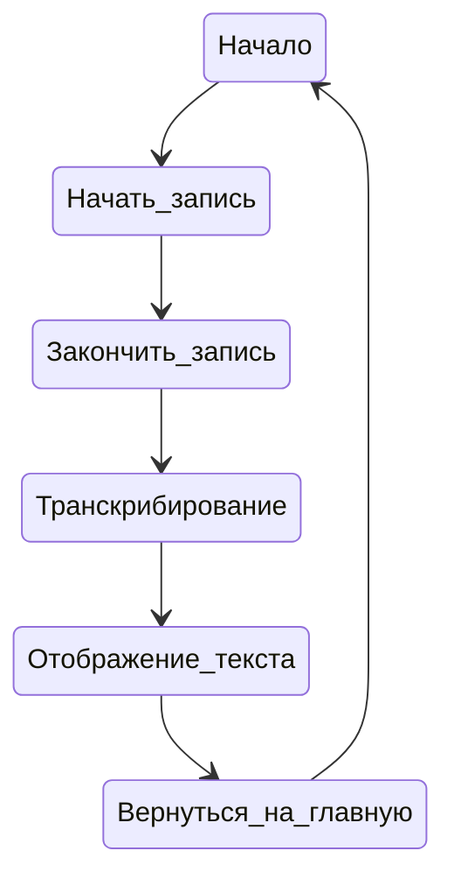
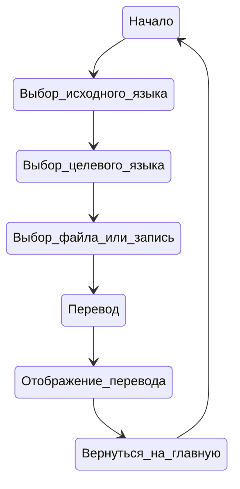
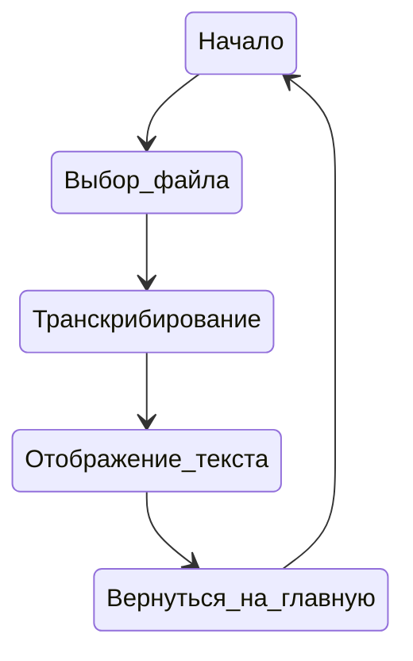
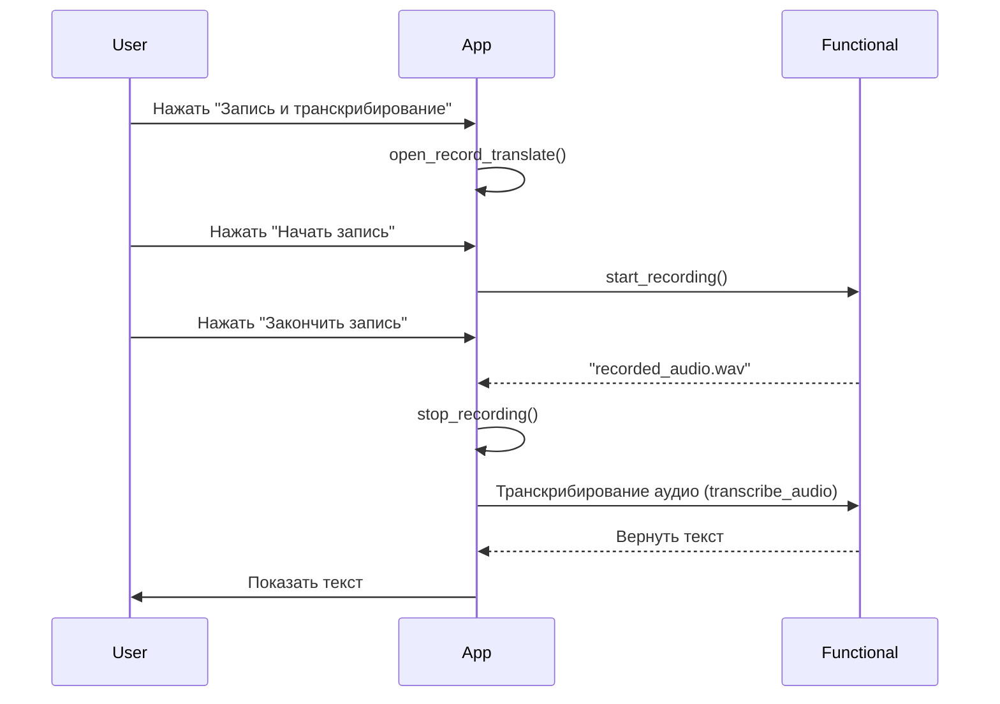

# Поведенческие модели

## Введение

В этом документе представлены поведенческие модели для различных функциональных возможностей нашего приложения. Мы используем диаграммы состояний и последовательности, чтобы визуализировать основные процессы, такие как запись и транскрибирование аудио, перевод текста на другой язык и транскрибирование из файла. Эти диаграммы помогут лучше понять, как пользователи взаимодействуют с приложением и как оно обрабатывает их действия.

## Диаграммы состояний

### Диаграмма состояния 1: Запись и транскрибирование

Описание:

1. Начало: Начальная точка процесса.
2. Начать запись: Пользователь начинает запись аудио.
3. Закончить запись: Пользователь завершает запись.
4. Транскрибирование: Приложение обрабатывает аудио и преобразует его в текст.
5. Отображение текста: Приложение показывает транскрибированный текст пользователю.
6. Конец: Завершение процесса.

### Диаграмма состояния 2: Перевод на другой язык

Описание:

1. Начало: Начальная точка процесса.
2. Выбор исходного языка: Пользователь выбирает язык, с которого будет производиться перевод.
3. Выбор целевого языка: Пользователь выбирает язык, на который будет производиться перевод.
4. Выбор файла или запись: Пользователь выбирает либо загрузить файл, либо начать запись аудио.
5. Перевод: Приложение переводит текст или аудио на целевой язык.
6. Отображение перевода: Приложение показывает переведенный текст пользователю.
7. Конец: Завершение процесса.

### Диаграмма состояния 3: Транскрибирование из файла

Описание:

1. Начало: Начальная точка процесса.
2. Выбор файла: Пользователь выбирает файл для транскрибирования.
3. Транскрибирование: Приложение обрабатывает аудио файл и преобразует его в текст.
4. Отображение текста: Приложение показывает транскрибированный текст пользователю.
5. Конец: Завершение процесса.

## Диаграммы последовательности

### Диаграмма последовательности 1: Запись и транскрибирование

Описание:

1. Нажать "Запись и транскрибирование": Пользователь инициирует процесс записи и транскрибирования.
2. open_record_translate(): Приложение открывает интерфейс записи.
3. Нажать "Начать запись": Пользователь начинает запись аудио.
4. start_recording(): Приложение начинает запись аудио.
5. Нажать "Закончить запись": Пользователь завершает запись.
6. stop_recording(): Приложение останавливает запись аудио и возвращает файл содержащий записанное.
7. Транскрибирование аудио (transcribe_audio): Приложение отправляет аудио для транскрибирования.
8. Вернуть текст: Функциональный модуль возвращает транскрибированный текст.
9. Показать текст: Приложение отображает транскрибированный текст пользователю.

## Заключение

Диаграммы состояний и последовательности, представленные в этом документе, помогают визуализировать основные процессы нашего приложения, включая запись и транскрибирование аудио, перевод текста на другой язык и транскрибирование из файла. Эти диаграммы обеспечивают лучшее понимание взаимодействия пользователей с приложением и его внутренней логики обработки данных.
