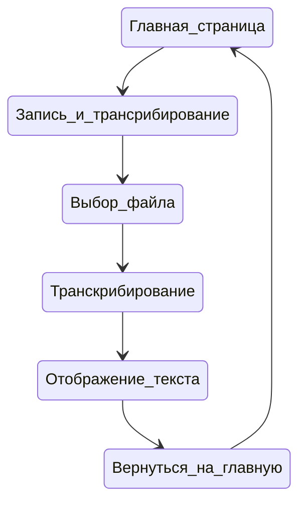
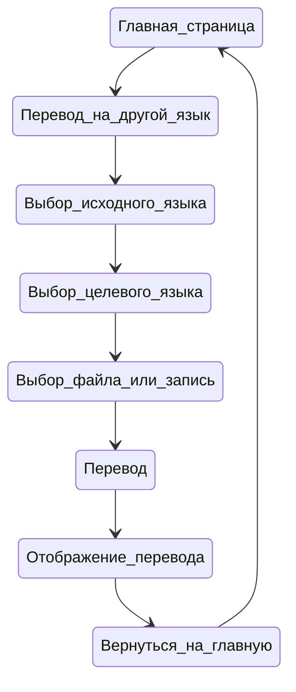
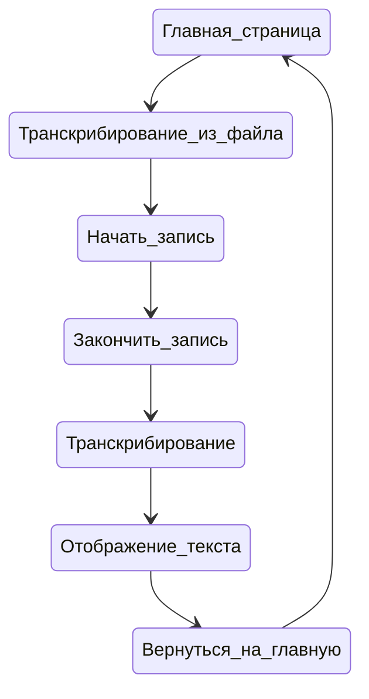
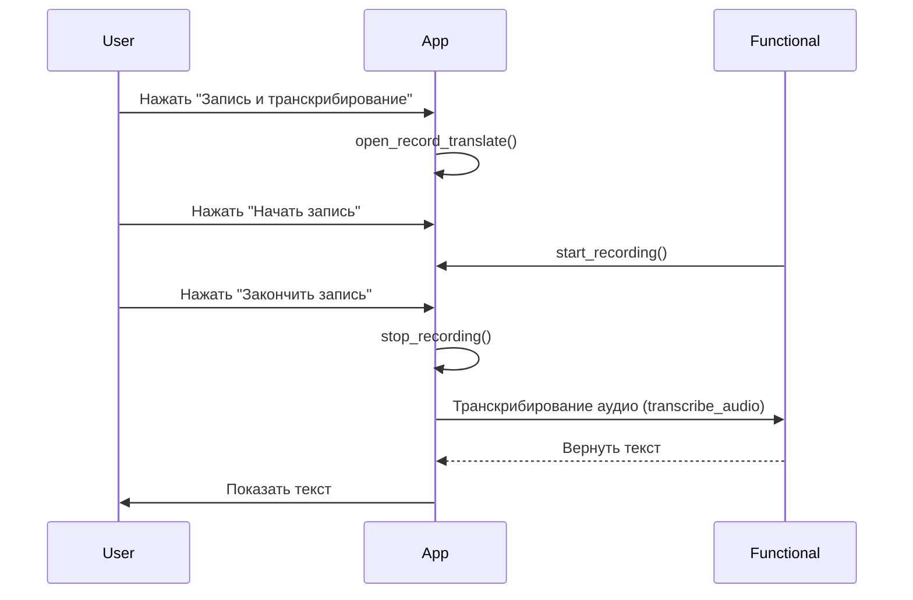
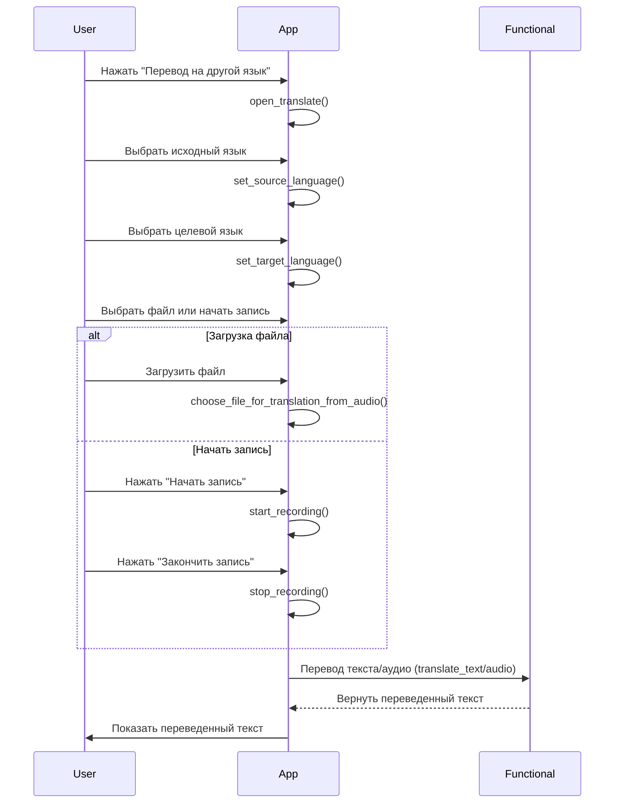
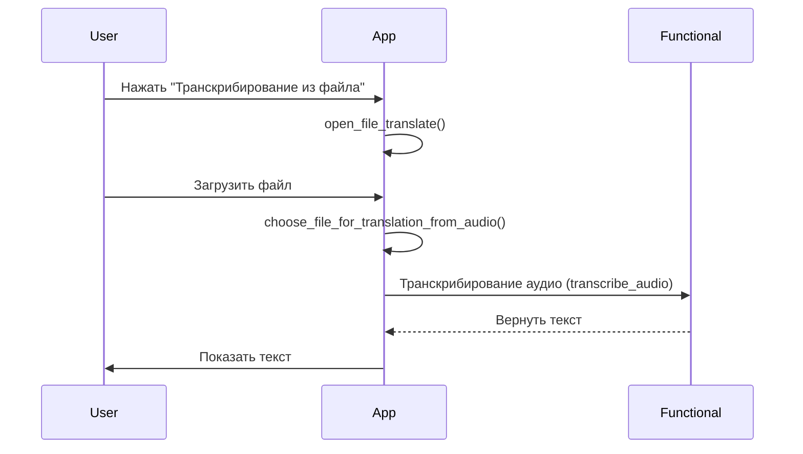

# Поведенческие модели

## Введение

В этом документе представлены поведенческие модели для различных функциональных возможностей нашего приложения. Мы используем диаграммы состояний и последовательности, чтобы визуализировать основные процессы, такие как запись и транскрибирование аудио, перевод текста на другой язык и транскрибирование из файла. Эти диаграммы помогут лучше понять, как пользователи взаимодействуют с приложением и как оно обрабатывает их действия.

## Диаграммы состояний

### Диаграмма состояния 1: Запись и транскрибирование

Описание:

1. Главная страница: Начальная активность приложения.
2. Запись и трансрибирование: Кнопка для перехода в след активность
3. Выбор файла: Пользователь выбирает файл для транскрибирования.
4. Транскрибирование: Приложение обрабатывает аудио файл и преобразует его в текст.
5. Отображение текста: Приложение показывает транскрибированный текст пользователю.
6. Вернуться на главную: Кнопка для возврата на главную страницу.

### Диаграмма состояния 2: Перевод на другой язык

Описание:

1. Главная страница: Начальная активность приложения.
2. Перевод на другой язык: Кнопка для перехода в след активность
2. Выбор исходного языка: Пользователь выбирает язык, с которого будет производиться перевод.
3. Выбор целевого языка: Пользователь выбирает язык, на который будет производиться перевод.
4. Выбор файла или запись: Пользователь выбирает либо загрузить файл, либо начать запись аудио.
5. Перевод: Приложение переводит текст или аудио на целевой язык.
6. Отображение перевода: Приложение показывает переведенный текст пользователю.
7. Вернуться на главную: Кнопка для возврата на главную страницу.

### Диаграмма состояния 3: Транскрибирование из файла

Описание:

1. Главная страница: Начальная активность приложения.
2. Транскрибирование из файла: Кнопка для перехода в след активность
3. Начать запись: Пользователь начинает запись аудио.
4. Закончить запись: Пользователь завершает запись.
5. Транскрибирование: Приложение обрабатывает аудио и преобразует его в текст.
6. Отображение текста: Приложение показывает транскрибированный текст пользователю.
7. Вернуться на главную: Кнопка для возврата на главную страницу.

## Диаграммы последовательности

### Диаграмма последовательности 1: Запись и транскрибирование

Описание:

1. Нажать "Запись и транскрибирование": Пользователь инициирует процесс записи и транскрибирования.
2. open_record_translate(): Приложение открывает интерфейс записи.
3. Нажать "Начать запись": Пользователь начинает запись аудио.
4. start_recording(): Приложение начинает запись аудио.
5. Нажать "Закончить запись": Пользователь завершает запись.
6. stop_recording(): Приложение останавливает запись аудио и возвращает файл содержащий записанное.
7. Транскрибирование аудио (transcribe_audio): Приложение отправляет аудио для транскрибирования.
8. Вернуть текст: Функциональный модуль возвращает транскрибированный текст.
9. Показать текст: Приложение отображает транскрибированный текст пользователю.

### Диаграмма последовательности 2: Перевод на другой язык

**Описание:**

1. **Нажать "Перевод на другой язык"**: Пользователь инициирует процесс перевода.
2. **open_translate()**: Приложение открывает интерфейс перевода.
3. **Выбрать исходный язык**: Пользователь выбирает язык, с которого будет производиться перевод.
4. **set_source_language()**: Приложение устанавливает исходный язык.
5. **Выбрать целевой язык**: Пользователь выбирает язык, на который будет производиться перевод.
6. **set_target_language()**: Приложение устанавливает целевой язык.
7. **Выбрать файл или начать запись**: Пользователь выбирает либо загрузить файл, либо начать запись аудио.
8. **Загрузка файла**:
   - **Загрузить файл**: Пользователь загружает файл для перевода.
   - **choose_file_for_translation_from_audio()**: Приложение загружает файл.
9. **Начать запись**:
   - **Нажать "Начать запись"**: Пользователь начинает запись аудио.
   - **start_recording()**: Приложение начинает запись аудио.
   - **Нажать "Закончить запись"**: Пользователь завершает запись.
   - **stop_recording()**: Приложение останавливает запись аудио.
10. **Перевод текста/аудио (translate_text/audio)**: Приложение отправляет текст или аудио для перевода.
11. **Вернуть переведенный текст**: Функциональный модуль возвращает переведенный текст.
12. **Показать переведенный текст**: Приложение отображает переведенный текст пользователю.

### Диаграмма последовательности 3: Транскрибирование из файла

**Описание:**

1. **Нажать "Транскрибирование из файла"**: Пользователь инициирует процесс транскрибирования из файла.
2. **open_file_translate()**: Приложение открывает интерфейс транскрибирования.
3. **Загрузить файл**: Пользователь загружает файл для транскрибирования.
4. **choose_file_for_translation_from_audio()**: Приложение загружает файл.
5. **Транскрибирование аудио (transcribe_audio)**: Приложение отправляет аудио файл для транскрибирования.
6. **Вернуть текст**: Функциональный модуль возвращает транскрибированный текст.
7. **Показать текст**: Приложение отображает транскрибированный текст пользователю.

## Заключение

Диаграммы состояний и последовательности, представленные в этом документе, помогают визуализировать основные процессы нашего приложения, включая запись и транскрибирование аудио, перевод текста на другой язык и транскрибирование из файла. Эти диаграммы обеспечивают лучшее понимание взаимодействия пользователей с приложением и его внутренней логики обработки данных.
