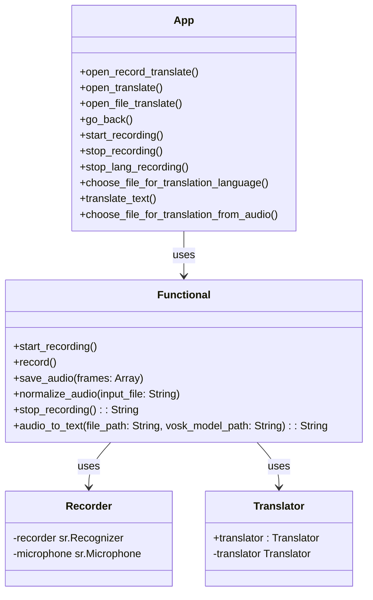
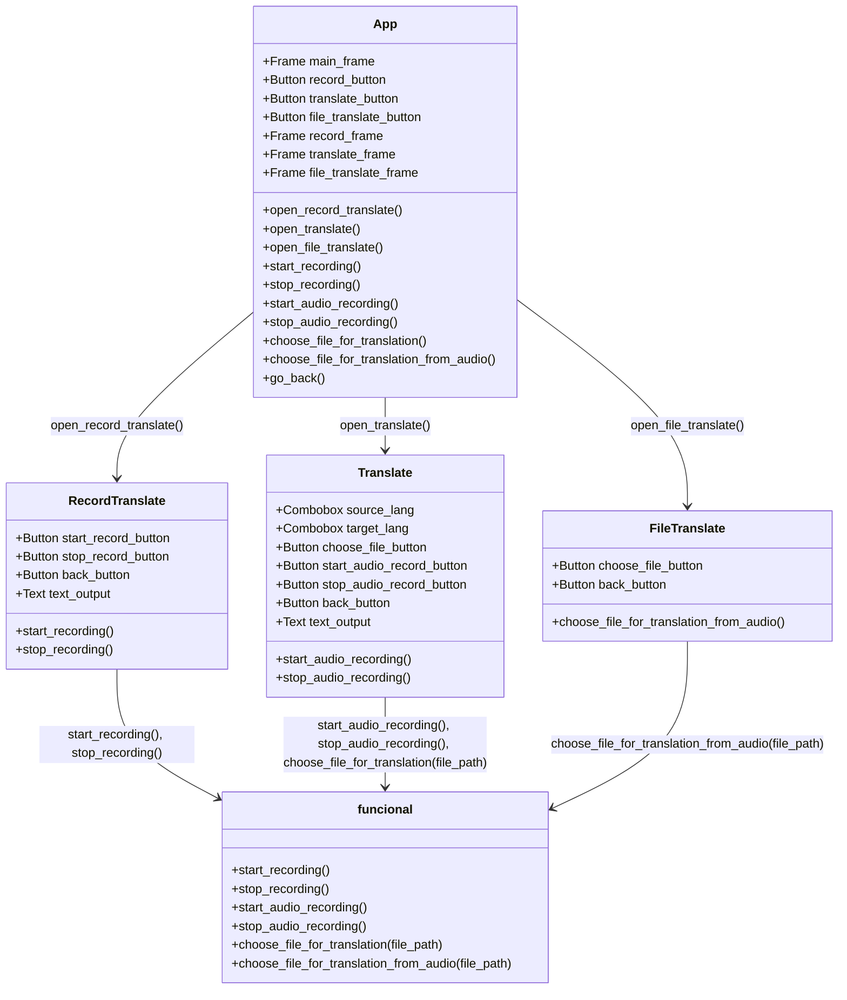

# Структурные модели

Этот документ описывает внутреннюю структуру приложения с использованием диаграмм классов и объектов/компонентов. Диаграммы выполнены с помощью Mermaid, позволяя визуализировать архитектурные решения и шаблоны проектирования, применяемые в проекте.

## Диаграмма классов

### Описание
Диаграмма классов показывает структуру основных классов, их взаимосвязи и методы.

#### Описание диаграммы классов

- **App:** Класс, который отрисовывает и отвечает за действия в пользовательском интерфейсе.
- **Functional:** Методы и нейронная сеть, которые занимаются переводом из аудио информации в текстовую, а также переводом на другой язык, запись речи и тд.

### Диаграмма объектов/компонентов

#### Описание
Диаграмма компонентов показывает основные компоненты приложения ui.py и их взаимодействие.

### Общее описание архитектуры

Приложение состоит из двух основных модулей: funcional.py, который производит все действия с аудио и текстом и ui.py, который предоставляет графический интерфейс пользователя для взаимодействия с функциональностью перевода аудио. Используется шаблон проектирования MVC, где functional.py выполняет роль модели, а ui.py — контроллера и представления.

